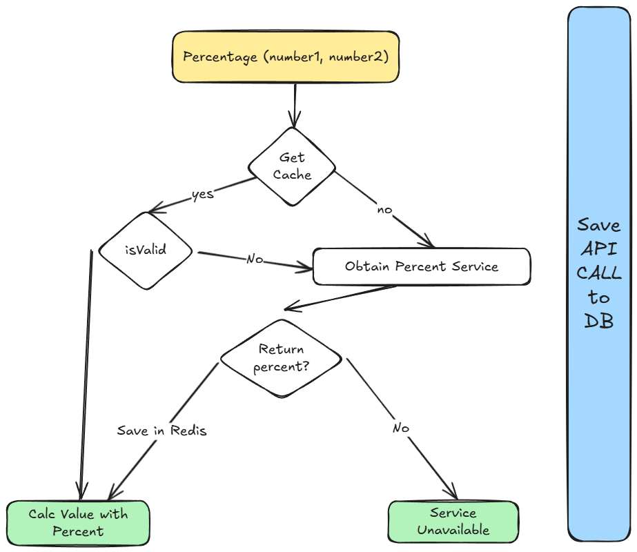
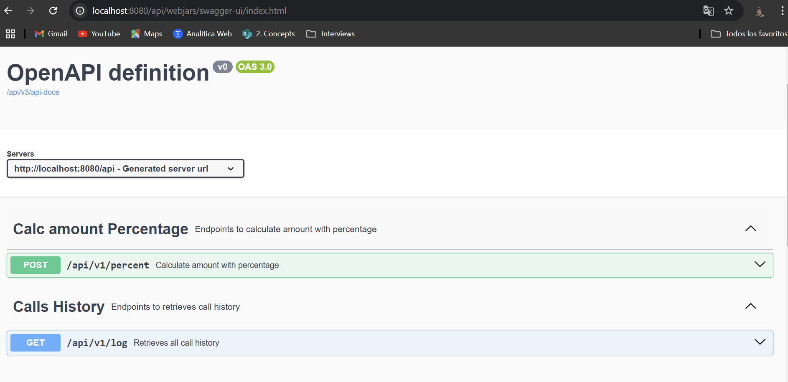

# API CHALLENGE

This API is the solution to the challenge proposed by Tenpo.
It is based on the creation of two endpoints which will be detailed later.

## Features

- Endpoint that receives two numbers and increases their sum by a percentage.
- Endpoint to obtain calls to the previous endpoint with pagination.

## Stack

- Spring WebFlux
- Postgres
- Docker
- OpenApi
- Java 21
- Resilience4j
- Spring AOP
- Redis
- R2DBC

## Challenge analysis



# Run Api locally

## Add environments values

    DB_PASSWORD=admin;DB_URL=r2dbc:postgresql://localhost:5432/demo;DB_USERNAME=admin;PERCENT_CLIENT_URL=https://run.mocky.io/v3/49fafe67-91d2-4f16-8546-81113d082e83;REDIS_CACHE_KEY=percent;REDIS_HOST=redis-13268.c1.us-central1-2.gce.redns.redis-cloud.com;REDIS_PASSWORD=Ov70KdUIufkjE5jsdK9OZjpN23Nthyoi;REDIS_PERCENT_VALID=30;REDIS_PORT=13268;REDIS_USERNAME=default;SERVER_PORT=8080

## Run the app

    ./gradlew bootRun

# Run Api with Docker

## Build App

    ./gradlew build

* The application requires Postgres running on port 5432

## Build image with Dockerfile

    docker build -t challenge .

## Run container with docker-compose

    docker-compose up

## Testing using swagger

    http://localhost:8080/api/swagger-ui.html



## Test Endpoint Percent

```json
{
  "first_number": 5,
  "second_number": 5
}
```

## Testing Call History

To get the call history you can use the default values
